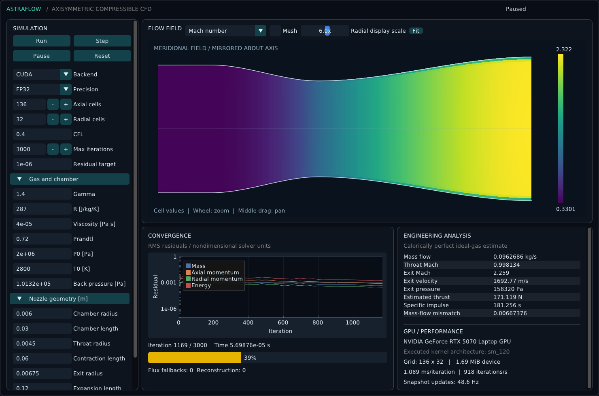

# AstraFlow

AstraFlow is being implemented as a GPU-accelerated axisymmetric compressible CFD simulator for rocket nozzle flows, using C++20 and CUDA, with a CPU reference backend.

**Development status:** Milestones 0–7 complete: verified CPU/CUDA Euler and axisymmetric viscous finite volumes, CLI, engineering analysis and reproducible output. The interactive GUI is verified; performance/final review remain in progress. See [Phase 1 status](docs/PHASE1_STATUS.md).

## Build

Dependencies are pinned: nlohmann/json 3.11.3 and Catch2 3.7.1 (MIT and BSL-1.0 respectively; upstream licenses remain in fetched sources). CMake downloads them at first configure. CPU builds need CMake 3.24+, Ninja and a C++20 compiler.

```sh
cmake -S . -B build-cpu -G Ninja -DCMAKE_BUILD_TYPE=Release -DASTRAFLOW_ENABLE_CUDA=OFF
cmake --build build-cpu
ctest --test-dir build-cpu --output-on-failure
```

CUDA builds require CUDA 12.8+ with native SM120 support:

```sh
cmake -S . -B build -G Ninja -DCMAKE_BUILD_TYPE=Release -DCMAKE_CUDA_COMPILER="$PWD/.toolchains/cuda-12.8.1/bin/nvcc"
cmake --build build
./build/astraflow_cli --device-info
```

The initial device check executes a CUDA kernel and reports its compiled architecture. WSL GPU access may require execution outside an agent sandbox.

## Scientific scope

The planned V1 model is a single-species, calorically perfect ideal gas with conservative finite volumes, MUSCL, HLLC/HLLE, SSP-RK2, axisymmetric geometry and Newtonian viscosity/Fourier heat conduction. This is a numerical discretisation of the Euler/Navier–Stokes equations; it is not a solution of the mathematical existence/smoothness problem.

Combustion, turbulence, external plumes and advanced thermodynamics are outside V1.

MIT license. CUDA remains subject to NVIDIA's license.

## Run a case

```sh
./build/astraflow_cli --config examples/rocket_nozzle/config.json --backend cuda
./build-cpu/astraflow_cli --config examples/sod/config.json --backend cpu
python3 scripts/check_run.py runs/<run-id>
```

Examples cover Sod, an inviscid isentropic nozzle, compressible Couette channel and a viscous ideal-gas rocket nozzle. `--output`, `--max-iterations` and `--precision float|double` override configuration values. Generated output directories are ignored and existing nonempty directories are protected.

## Interactive GUI

```sh
# Only if GUI development headers are missing on Ubuntu 24.04:
bash scripts/bootstrap_gui.sh
cmake -S . -B build -DASTRAFLOW_BUILD_GUI=ON
cmake --build build
./build/astraflow_gui --config examples/rocket_nozzle/config.json
```



Run/Pause/Step/Reset and Regenerate Mesh command the same solver used by the CLI. The field selector includes pressure, density, temperature, Mach, velocity components/magnitude, energy and vorticity. Geometry edits apply after pause/regeneration. Radial display magnification is labelled and does not alter exported geometry.
