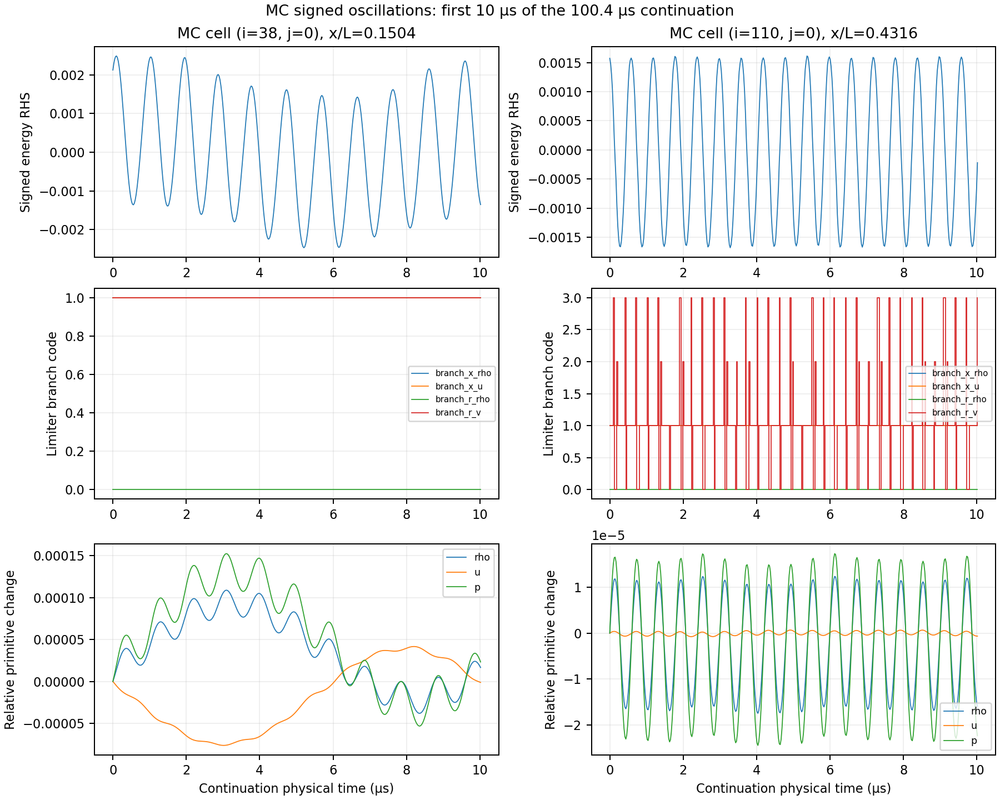
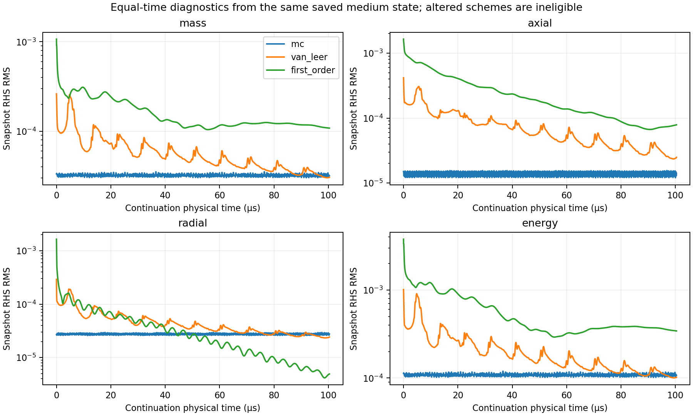
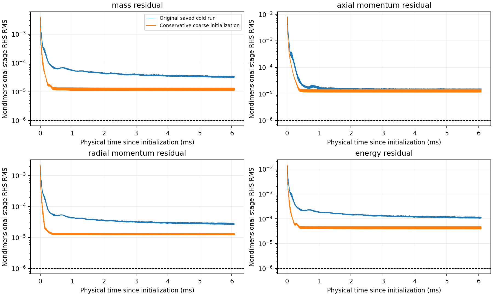

# V1.1-C2b: medium-grid residual investigation

This investigation continues `v1.1-scientific-closure` from `2dd20a1`. It reuses the accepted 128×32 CUDA FP64 field and the saved, rejected 250,000-step 256×64 field. It does not rerun either source case, launch 512×128, change convergence thresholds, implement pseudo-time stepping, or promote altered reconstruction diagnostics to study solutions.

## Diagnostics and conventions

For each cell, with per-radian axisymmetric volume \(V_i=\int_i r\,dx\,dr\), the existing production operator is

\[
R_i(U)=-V_i^{-1}\sum_{f\in\partial i} A_f F^c_f n_{if}
       +V_i^{-1}\sum_{f\in\partial i} A_f F^v_f n_{if}+S_i.
\]

The flux routines already include the face-normal projection; \(n_{if}\) here denotes the signed face orientation. The diagnostic reports these three terms separately and also calls the unchanged production residual assembly. Its global identity is

\[
\sum_i V_iR_i=-\sum_{f\in\partial\Omega}A_f(F^c_f-F^v_f)n_f+\sum_i V_iS_i.
\]

Boundary groups are inlet, outlet, wall and axis. All four equations are retained. Viscous flux contains axial/radial stress and energy stress-work plus conduction. The radial source contains pressure and the cylindrical hoop stress, reported separately: \(S_{r,i}=(p_i-\tau_{\theta\theta,i})\,s_i\). Wall pressure force must be retained in both momentum balances. At a stationary adiabatic no-slip wall, viscous energy flux should be roundoff, while wall shear contributes momentum.

The snapshot diagnostic calls the same reconstruction, boundary-state, HLLC, corrected transport-gradient and source functions as production, in FP64 with contraction disabled. CUDA advances the states; host FP64 evaluates the saved snapshots. A small-step regression compares this snapshot RHS with the production time derivative for all three tested reconstructions. Existing CUDA parity regressions cover the shared implementation. Algebraic flux cancellation is a consistency test, not proof that every model/discretization choice is physically exact.

All probe fields, gradients, fluxes, sources and times are nondimensional. The reference scales are included in the results JSON. Integrated flux/source quantities are **per radian**. Dimensional global rate multipliers are \(\rho_*a_*L_*^2\), \(\rho_*a_*^2L_*^2\) for each momentum equation, and \(\rho_*a_*^3L_*^2\) for energy; multiply by \(2\pi\) for full revolution. Local slopes `sx/sr` are limited primitive jumps in logical coordinates, not physical gradients. `gx/gr` are physical-coordinate gradients of normalized `(rho,u,v,T)`. Raw limiter jumps use `(rho,u,v,p)`.

`relative_identity_error` is the absolute difference between integrated cell RHS and boundary-plus-source prediction, divided by the sum of magnitudes of each boundary convective/viscous term and each integrated pressure/hoop source. `relative_global_rhs` uses the same denominator but the magnitude of the actual integrated RHS. A small first quantity demonstrates consistent assembly; a nonzero second quantity describes remaining global evolution. Numerical inlet/exit mass mismatch uses the larger magnitude of the two numerical mass fluxes as denominator. The existing `interior_cell_estimate` remains separately named and unchanged, including its station estimate and acceptance gates.

The solver's production residual CSV measures the second SSPRK2 stage. Probe RMS measures \(R(U)\) at the final state of each complete step. Those two sampling locations are retained and must not be silently equated.

## Initialization and experiment design

Conservative prolongation uses logical 2:1 refinement in both directions. For a parent with conservative mean \(U_P\), the four child means are

\[
U_c=\frac{V_P}{\sum_cV_c}U_P+\alpha\left(\delta_c-
\frac{\sum_cV_c\delta_c}{\sum_cV_c}\right),\qquad
\delta_c=\pm\tfrac14\sigma_x\pm\tfrac14\sigma_r.
\]

The slopes are MC-limited **conservative** differences; missing boundary differences give zero slope. A single common \(\alpha\in[0,1]\) would reduce all four perturbations if positivity required it. This preserves \(\sum_cV_cU_c=V_PU_P\) for each of the four conserved components, rather than interpolating primitives. The independently sampled nozzle contour means fine child volumes need not sum exactly to the coarse polygon volume; the displayed volume-ratio correction accounts for this geometric difference. This is an initializer, not a production limiter modification.

The new CLI `--initial-state FILE` reads schema-1 physical conservative cell means in row-major order (`j*nx+i`), checks physical/configuration compatibility, converts through the existing nondimensional initialization, and writes provenance to `initialization.json`. It resets the iteration/time/convergence history for a fresh run. It is not a checkpoint that resumes old monitor state. The warm run retains the saved medium production configuration, including MC, CUDA FP64, CFL 0.4, a 250,000-step cap, all four 1e-6 residual criteria, and the entire original engineering/conservation window.

Each short diagnostic starts independently from exactly the same saved medium primitive field. The final step is capped so all three modes have exactly the same physical duration. First-order reconstruction is exposed only through the diagnostic executable; production configuration parsing rejects it. Van Leer and first order change the spatial operator and are ineligible for study acceptance. They test sensitivity, not convergence to the MC discrete root.

At every step, tracked cells record signed residual decomposition, primitives, transport gradients, limited slopes, raw one-sided reconstruction jumps, limiter branches and reconstruction/HLLC fallback counts. The common watch set is selected from the top eight MC residual cells per equation, plus radial samples near x/L=0.15 and 0.43. Full-grid initial/final CSVs rank dominant cells independently. MC branch codes: 0 zero/sign change, 1 centered, 2 left bound, 3 right bound; Van Leer harmonic branch 4, diagnostic first order 5. Switching counts describe sampled branch transitions; temporal correlation alone does not prove causation.

## Reproduction and artifact policy

With the existing source runs and CUDA build available:

```sh
.venv/bin/python scripts/run_residual_closure.py prepare
.venv/bin/python scripts/run_residual_closure.py warm
.venv/bin/python scripts/run_residual_closure.py probes --duration 20 --sample-steps 1
.venv/bin/python scripts/analyze_residual_closure.py
```

Preparation and the warm run refuse to overwrite existing artifacts. Completed probe directories are preserved. Do not rerun these commands against the recorded source/output paths merely to reproduce a report; the analysis command alone reads existing outputs. Raw fields/traces remain under ignored `runs/residual-closure-c2b/`; compact numerical evidence and figures are versioned here. Source field/configuration/summary SHA-256 hashes, initialization audit and execution-binary hashes accompany the evidence. The preparation binary and probe execution binary have distinct recorded hashes because the CSV header was corrected before probe execution; the prolongation implementation was unchanged.

## Measured balances

At the saved medium state, before continuation, the numerical flux budgets are below. Each row is a four-component vector `(mass, axial momentum, radial momentum, energy)` in the nondimensional per-radian convention above. These are actual numerical face fluxes, including reconstructed boundary states.

| Contribution | Mass | Axial momentum | Radial momentum | Energy |
|---|---:|---:|---:|---:|
| Inlet outward convective | -0.339320444777 | -0.955527044881 | 0 | -1.187622759350 |
| Outlet outward convective | 0.339320401440 | 0.726858211509 | 0.002744746218 | 1.187622293580 |
| Wall outward convective | 1.47e-16 | 0.213647206833 | 27.166604373204 | -2.62e-17 |
| Inlet outward viscous/thermal | 0 | 8.90002e-11 | 2.13769e-6 | -1.26428e-10 |
| Outlet outward viscous/thermal | 0 | 3.14264e-7 | -1.11152e-5 | -3.93624e-7 |
| Wall outward viscous/thermal | 0 | -0.015021562859 | -0.000105985374 | -1.09e-23 |
| Integrated pressure source | 0 | 0 | 27.169469643188 | 0 |
| Integrated hoop-stress source | 0 | 0 | 2.94721e-6 | 0 |
| Integrated cell RHS | 4.33367e-8 | 3.78032e-7 | 8.50806e-6 | 7.20199e-8 |
| Relative global RHS | 6.38581e-8 | 1.97814e-7 | 1.56574e-7 | 3.03210e-8 |
| Absolute assembly identity error | 6.27e-17 | 4.54e-16 | 1.19e-15 | 2.78e-16 |

Axis fluxes are exactly zero. Over **every sample of all three continuations**, the maximum relative assembly error is **6.88e-15**. The MC initial local decomposition discrepancy is 2.84e-14 absolute. These errors are consistent with summation/cancellation roundoff, many orders below the observed residuals.

The initial numerical inlet/exit mass mismatch is **1.27716e-7**, compared with the unchanged interior-cell estimate **0.00117815**. At the end of the MC continuation, numerical mismatch is **1.13115e-7**. This rules out a missing net boundary mass flux as the explanation for the much larger cell estimate. It does not authorize replacing that estimator or its threshold. Axial wall shear and the pressure/hoop source are essential: omitting them would manufacture a large momentum imbalance.

## Dominant residuals and oscillations

Initial full-grid RMS decomposition:

| Equation | Total RHS | Convective | Viscous/thermal | Axisymmetric/source |
|---|---:|---:|---:|---:|
| Mass | 3.32931e-5 | 3.32931e-5 | 0 | 0 |
| Axial momentum | 1.50852e-5 | 1.74513e-3 | 1.74529e-3 | 0 |
| Radial momentum | 2.69274e-5 | 8.5808563 | 2.13055e-5 | 8.5808572 |
| Energy | 1.12657e-4 | 3.23421e-4 | 3.03394e-4 | 0 |

These are norms of signed terms; their norms do not add. In particular, the radial pressure/source cancellation is expected in cylindrical finite volumes.

The initial dominant cells, ranked by absolute local RHS, are:

| Equation | Rank 1 `(i,j)`: signed RHS | Rank 2 | Rank 3 |
|---|---|---|---|
| Mass | (38,0): +6.19648e-4 | (38,1): +5.42918e-4 | (39,0): +4.97688e-4 |
| Axial momentum | (110,0): +4.96801e-4 | (111,0): +4.20885e-4 | (109,0): +3.92419e-4 |
| Radial momentum | (105,62): -5.52898e-4 | (105,61): -5.20556e-4 | (105,57): +3.15306e-4 |
| Energy | (38,0): +2.12590e-3 | (38,1): +1.86023e-3 | (39,0): +1.69957e-3 |

At `(38,0)`, x/L=0.150390625, the initial energy RHS is convective **+2.1258294e-3**, transport **+6.59172e-8**, source zero. At `(110,0)`, x/L=0.431640625, the initial axial RHS is convective **+4.9703301e-4**, transport **-2.31905e-7**, source zero. The near-wall radial maximum `(105,62)` is convective **-0.5946078386**, transport **+4.63434e-5**, source **+0.5940085969**, leaving **-5.52898e-4**. Thus neither a single omitted source nor a wall-only error explains the pattern.

Ranking changes with oscillation phase. After the MC continuation the largest energy cells are `(105,62)` **-1.51989e-3**, `(110,0)` **-1.39531e-3**, and `(109,0)` **-1.26020e-3**. The first four radial rows account for **27.36%** of squared energy RHS initially and **18.30%** finally. The results JSON contains the top twelve cells for every equation at both endpoints and signed decompositions.

All continuations last exactly **20 normalized time units = 100.397418 µs**. MC and Van Leer take **4,130 steps** each; first order takes **4,134**, because its state-dependent timestep changes. All are CUDA FP64 at CFL 0.4, sampled every step, with zero reconstruction/HLLC fallbacks. Initial primitive fields are verified bitwise identical across the three probe exports.

| MC focus cell | Energy RHS min / max | Sign reversals | First / last quarter energy RMS | Dominant sampled period |
|---|---:|---:|---:|---:|
| (38,0) | -2.59660e-3 / +2.59226e-3 | 211 | 1.43520e-3 / 1.46346e-3 | 0.9474 µs |
| (110,0) | -1.68229e-3 / +1.61588e-3 | 335 | 1.16165e-3 / 1.16088e-3 | 0.6013 µs |

The periods are discrete spectral estimates of linearly detrended full-duration signals; the selected bins carry 67.5% and 53.8% of sampled nonzero-frequency power. They establish resolved cycling, not an exact analytic period or an infinite-time limit cycle.

At `(110,0)`, the radial-velocity MC branch switches **1,093 times** among zero, centered and either limited bound. The mean absolute energy-RHS change per interval is **4.15618e-4** when this branch switches versus **2.08353e-4** otherwise. The radial velocity gradient crosses zero, ranging **-3.48386e-4 to +3.01208e-4**. At `(38,0)`, its own branches remain fixed, with axial fields centered, radial density/axial velocity/pressure slopes zero, and radial velocity centered. Its neighboring cell `(38,1)` switches radial density/pressure branches **122/120 times** and shares **211** energy sign reversals. The near-wall cell `(105,62)` has **334** radial-pressure branch transitions and **335** energy sign reversals. The data support coupled reconstruction-sensitive oscillation; they do not prove that a particular local branch switch initiates it.

Primitive states and gradients remain small bounded perturbations:

| MC cell | Initial `(rho,u,v,p)` | Full-trace primitive ranges `(rho,u,v,p)` | `du/dx` range | `dv/dr` range |
|---|---|---|---|---|
| (38,0) | (0.9401613, 0.4129845, -2.28343e-5, 0.9172407) | (1.40219e-4, 4.86720e-5, 8.47627e-6, 1.91524e-4) | [0.00435680, 0.00443382] | [-0.00228671, -0.00152635] |
| (110,0) | (0.6341006, 1.0798680, -3.17906e-6, 0.5284731) | (1.89663e-5, 1.56061e-6, 5.70395e-6, 2.21312e-5) | [0.07061797, 0.07062681] | [-0.000348386, 0.000301208] |



## Reconstruction comparison

Every mode is evaluated using its own spatial operator. The different initial RHS values below occur at the **same initial state** because changing reconstruction changes R(U). The large initial transient in the altered schemes must not be mistaken for a common-operator acceleration rate.

| Mode | Initial energy RMS | Final mass / axial / radial / energy RMS | Energy sign reversals at (38,0) / (110,0) |
|---|---:|---|---:|
| MC | 1.12657e-4 | 3.17171e-5 / 1.41476e-5 / 2.76943e-5 / 1.07227e-4 | 211 / 335 |
| Van Leer, diagnostic only | 1.01028e-3 | 3.05273e-5 / 2.48752e-5 / 2.41528e-5 / 1.02049e-4 | 38 / 118 |
| First order, diagnostic only | 3.77153e-3 | 1.08223e-4 / 7.86952e-5 / 4.92767e-6 / 3.42599e-4 | 6 / 24 |

Van Leer's last-quarter local energy RMS is **3.89642e-4 / 2.87170e-4** at the two focus cells, versus MC's **1.46346e-3 / 1.16088e-3**. First order gives **7.03125e-4 / 9.97265e-5**, with slowly evolving nonzero means as its different solution adjusts. Rapid MC cycling is substantially suppressed by changed reconstruction; first order does **not** provide lower final global energy RMS. None is an accepted study solution, and these short probes do not establish the eventual steady behavior of either altered scheme.



## Conservative warm-start comparison

Maximum parent-cell relative integral error over all four conserved quantities: **4.99950e-16**. Maximum coarse-volume/summed-fine-volume ratio change: **1.78450e-4**. Positivity-limited parents: **zero**. A separate initialization regression verifies the physical-to-normalized-to-physical conservative round trip.

The fresh warm case reaches **250,000 steps**, **6.078418968 ms**, **261.409 s wall**, and terminates `iteration_limit`. Final residuals are **[1.29813e-5, 1.38140e-5, 1.34216e-5, 4.56788e-5]**. The original saved cold run ends at **6.078589072 ms**, with **[3.35255e-5, 1.55033e-5, 2.71686e-5, 1.13501e-4]**. The final energy residual is 2.48× lower with prolongation, but every component still exceeds 1e-6.

Matched physical-time energy RMS, linearly interpolated in each existing output history:

| Time since initialization | Original cold | Conservative warm |
|---|---:|---:|
| 0.1 ms | 1.07698e-3 | 2.02210e-4 |
| 0.5 ms | 2.13165e-4 | 4.48933e-5 |
| 1 ms | 1.90516e-4 | 4.61672e-5 |
| 2 ms | 1.44965e-4 | 4.33676e-5 |
| 4 ms | 1.17631e-4 | 4.66933e-5 |
| 6 ms | 1.14253e-4 | 4.47790e-5 |

Over steps 200,000–250,000, least-squares slopes of log energy RMS versus physical time are **-46.3594 s⁻¹** cold and **+0.0289876 s⁻¹** warm. The warm history spans **3.90568e-5–4.82815e-5** in this window, with essentially no fitted decay. Endpoint variation reflects phase, so no projected step count to convergence is claimed. Prolongation removes much of the slow initial relaxation and exposes a persistent oscillatory residual band.

The warm maximum relative range of the six engineering observables is **4.66025e-9**, with zero fallbacks and positive finite fields. However, its unchanged cell-based inlet/exit mismatch is **0.0011782117 > 0.001**; station spread **0.0013281284 < 0.002**. Stable engineering outputs do not grant convergence. The mass-estimate gate is a separate unresolved acceptance constraint and could remain problematic even if R(U) is driven to zero.



## Classification and next mathematical step

| Candidate explanation | Finding |
|---|---|
| Actual numerical defect | No flux/source omission, conservation-assembly bug, positivity failure or CPU/CUDA inconsistency was demonstrated. The tests are not a proof that every discretization choice is defect-free. |
| Limiter/reconstruction limit cycle | **Strong evidence for a small reconstruction-sensitive numerical oscillation**, with repeatable signed cycles, near-axis and neighboring limiter switching, and reduced cycling under altered reconstruction. A permanent asymptotic limit cycle, and whether switching is cause or response, remain unproved. |
| Boundary/source imbalance | Not supported as the dominant residual cause: all four numerical balances assemble to roundoff, and relative MC global evolution is approximately 1e-8–1e-7. The distinct interior-cell mass estimate still fails its fixed gate. |
| Slow physical/numerical relaxation | Present in the cold-run envelope, but insufficient as the sole explanation. Conservative initialization reduces that transient, then produces an essentially flat late residual band; dominant cells reverse sign hundreds of times. |
| Still unresolved | **V1.1 medium-grid steady closure remains unresolved.** No accepted 256×64 result, 512×128 result, grid-independence claim or Richardson/GCI estimate follows from C2b. |

Further brute-force global explicit continuation has weak justification given the warm plateau. A proposed next experiment is a separate **implicit pseudo-transient steady solve**, retaining the exact MC operator. This is a proposal only; no acceleration code was added.

Let \(F(U)=M R(U)\), with \(M=\operatorname{diag}(V_i I_4)\), including the same numerical boundary fluxes, transport terms and cylindrical sources. A backward-Euler pseudo-time correction satisfies

\[
G(\delta)=\frac{M}{\Delta\tau}\delta-F(U^k+\delta)=0.
\]

Solve this nonlinear equation approximately with Newton–Krylov; the linearized correction at zero is

\[
\left(\frac{M}{\Delta\tau}-J_F(U^k)\right)\delta=F(U^k),
\qquad U^{k+1}=U^k+\alpha\delta.
\]

A positive diagonal local pseudo-time mass \(D_i=V_i/\Delta\tau_i\) could later replace \(M/\Delta\tau\), with \(\Delta\tau_i\) based on the existing convective/diffusive cell spectral estimate. Such a matrix changes the path to a root, not the equation at a root: for any finite positive D, a converged correction \(\delta=0\) implies **F(U)=0**, and every F(U)=0 state is fixed. Conversely, vanishing pseudo-step size can give a small update with a large residual, so update size must never be the acceptance test.

Start with global pseudo-time for a controlled comparison, and ramp it only after true residual decrease. Use frozen limiter branches/transport coefficients only inside an approximate Jacobian or preconditioner; recompute the full nonlinear MC residual, boundary states and source at every candidate. A positivity-preserving line search reduces alpha without clipping conservative fields. Require reduction of the full scaled residual merit function (or backtrack the pseudo-time step); keep the physical engineering/conservation acceptance gates unchanged. Pseudo-time is not physical transient time. Test root preservation, the existing rest/transport verifications, CPU/CUDA residual agreement, and recovery of the previously accepted coarse root before any scientific use.

Implicit damping may suppress the observed explicit cycles, but the current evidence does not guarantee that an accessible stable MC root satisfies all existing acceptance gates. In particular, the cell-estimate discrepancy must be evaluated at the actual converged discrete state; no estimator redefinition is part of this proposal.

## Validation and published evidence

- Initial CPU targeted balance/convergence/verification run: **1,992 assertions / 11 cases passed**.
- CUDA parity/transport plus balance run: **5,785 assertions / 11 cases passed**.
- Added direct derivative and physical-initialization tests: CPU **2,713 assertions / 5 balance cases**; CUDA-build executable balance/convergence **2,739 assertions / 10 cases**, passed.
- Targeted CPU CTest `unit`, `closure_analysis`, `cli_help`: **3/3 passed**. The system-Python analysis entry skips three optional NumPy postprocessing tests; all **9 Python analysis tests pass** when explicitly run in the existing project analysis `.venv`.
- Warm JSON/CSV/VTK structure, finite positive fields and engineering consistency pass. Analysis asserts unchanged production configuration and identical initial primitive fields for the three probes. Scientific convergence remains false.

[Machine-readable evidence](residual_closure_c2b_results.json) includes all boundary budgets, top-cell rankings, signed statistics, primitive/gradient ranges, limiter counts, warm/cold convergence rates and source hashes. [Full-cadence focus traces](c2b_focus_traces.csv.gz) contain every recorded column for cells `(38,0)` and `(110,0)` in all modes, losslessly compressed; [global RMS histories](c2b_rms_history.csv) contain every sample. Other tracked-cell raw data remain in the preserved local run directory. Plotting uses the already installed `requirements-analysis.txt` environment; no new or global dependency was installed.
