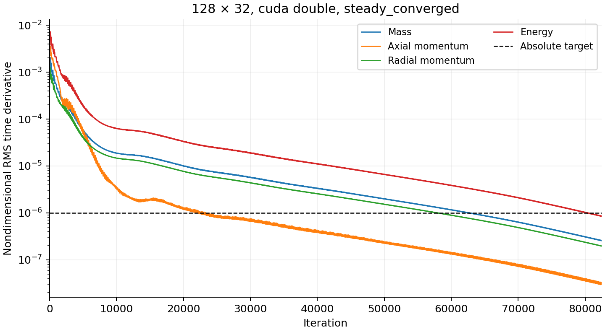
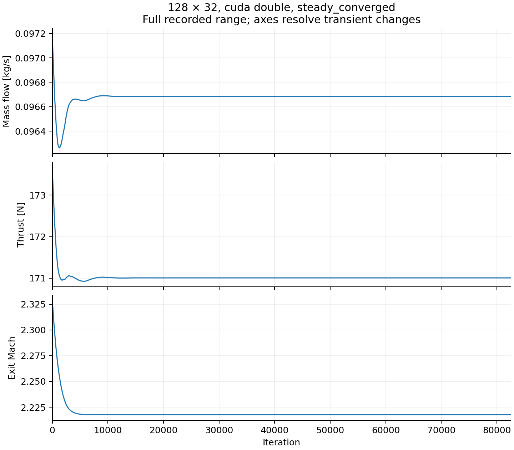
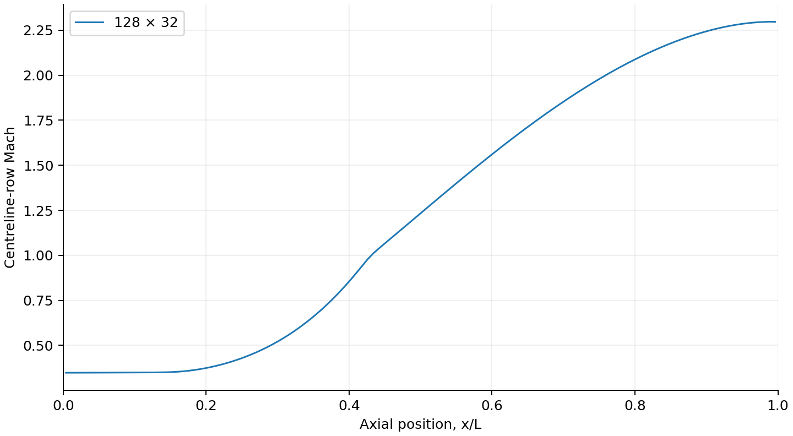
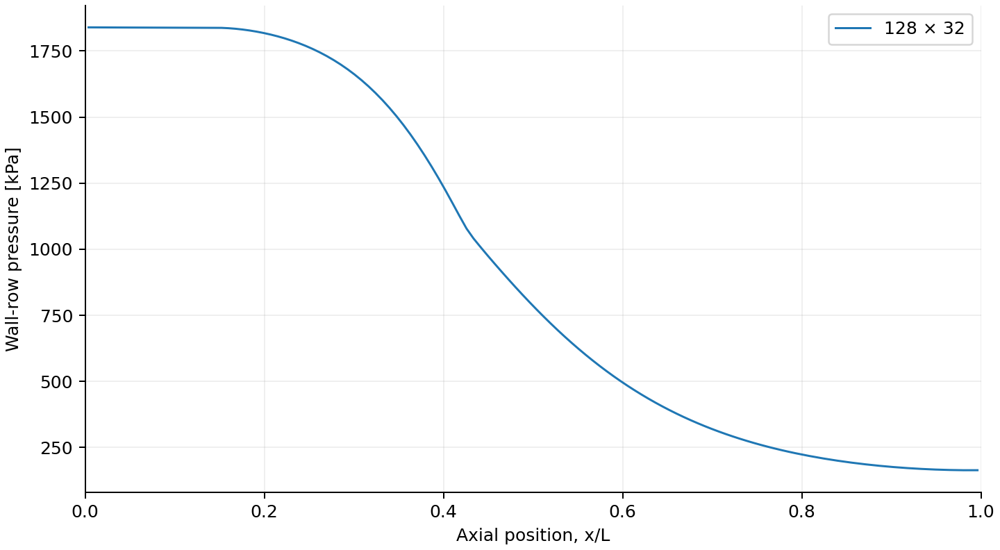
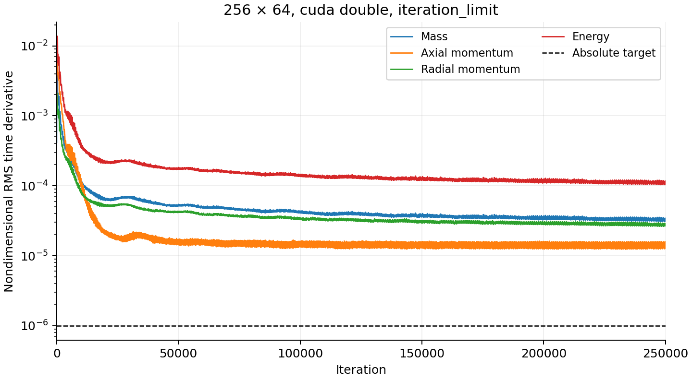

# Rocket scientific closure — V1.1

**Scientific acceptance is unresolved.** The 128x32 rocket case is steady-converged on CPU and CUDA FP64. The 256x64 case fails the unchanged residual and existing inlet/exit estimate criteria. The grid sequence was stopped; no rocket grid-independence, Richardson order or GCI result is claimed.

## Configuration

The dedicated `examples/rocket_nozzle/scientific_closure.json` retains the Phase 1 physical case: chamber/throat/exit radii 0.006/0.0045/0.00675 m, chamber/contraction/expansion lengths 0.03/0.06/0.12 m, P0=2 MPa, T0=2800 K, ambient pressure 101325 Pa, gamma=1.4, R=287 J/(kg K), constant viscosity 4e-5 Pa s and Pr=0.72. Walls are stationary, no-slip and adiabatic. MC/MUSCL, HLLC/HLLE, SSP-RK2 and CFL=0.4 are unchanged. Scientific runs use FP64 throughout; no solver-kernel mathematics was changed.

The first grid is 128x32. An initial safety allowance of 150,000 iterations permits observation of convergence; it is not a claimed convergence time. Each run stops automatically only when the criteria below pass or an explicit limit/failure occurs.

## Convergence definition

The monitor samples the first completed step and then every 20 iterations. Initial residuals mean the first completed step's nondimensional RMS time derivatives, not the unadvanced zero diagnostics. After at least 5,000 iterations, the final 2,000-iteration window must simultaneously satisfy:

- Every sampled mass, axial-momentum, radial-momentum and energy residual <= 1e-6.
- Relative range `(max-min)/abs(mean)` <= 5e-4 for mass flow, thrust, Isp, throat Mach, exit Mach and exit pressure.
- Inlet/exit relative mass-flow mismatch <= 1e-3 and station relative mass-flow spread <= 2e-3 at every sampled point.

The population relative standard deviation and least-squares relative drift (slope times window span divided by absolute mean) are also recorded. Zero means use a 1e-30 denominator floor; undefined Isp cannot pass. An optional additional relative residual target is supported; zero disables that extra condition, never the absolute target. Reduction factors are initial/final (larger means more reduction); undefined zero-denominator factors are null.

Summary fields include `termination_reason`, `converged`, `initial_residuals`, `final_residuals`, `residual_reduction_factors`, `convergence_window` and `observable_stability`. Existing `termination` and `residuals_nondimensional` keys remain. A legacy residual-only stop is no longer labelled steady convergence. SIGINT/SIGTERM request `user_stop`; numerical-step exceptions produce `invalid_state` metadata without exporting an invalid final field. CLI configuration/startup failures remain errors, not completed simulations.

## Reproduction and run preservation

```sh
# Figure dependency only; analysis statistics and orchestration use the standard library.
.venv/bin/python -m pip install -r requirements-analysis.txt
.venv/bin/python scripts/run_scientific_closure.py --grids 128x32
# Only after the first grid is independently verified:
.venv/bin/python scripts/run_scientific_closure.py --grids 128x32 256x64 512x128 \
  --iteration-limit 256x64=250000 --iteration-limit 512x128=250000
.venv/bin/python scripts/analyze_scientific_closure.py runs/scientific-closure
.venv/bin/python -m unittest discover -s tests/analysis -v
```

The runner invokes the CLI sequentially and keeps each attempt under its grid directory. Completed runs are reused only after independent convergence checks and matching configuration, executable SHA256 and output checksums. Interrupted, failed or incompatible attempts are preserved. An exclusive lock prevents overlapping orchestrators. Resume restarts an incomplete attempt from its original initial condition in a new directory; it does not claim checkpoint restart. No unconverged case may advance to the next grid.

## Analysis definitions

Consecutive-grid relative differences use the finer value as denominator. Goals are 0.5% for mass flow, thrust, Isp, throat Mach and exit Mach, and 1% for exit pressure. Profiles use the first radial cell row as the centreline approximation and last row as the wall-pressure approximation. Axial profiles are linearly interpolated onto 2,049 common x/L points within their shared cell-centre extent; no endpoint extrapolation hides differences near the throat.

For r=2 and monotonic, decreasing, non-roundoff differences, observed order is `log(abs((coarse-medium)/(medium-fine)))/log(2)`. Richardson extrapolation is `fine+(fine-medium)/(2^p-1)` and fine-grid GCI is `100*1.25*abs((fine-medium)/fine)/(2^p-1)` percent. Oscillatory/non-monotonic, non-decreasing or roundoff-level sequences are rejected. These estimates assume a leading single power of h; three samples alone do not independently prove the asymptotic regime. Synthetic first-, second- and third-order sequences with both signs test the formulas.

## Steady-state result

The 128x32 CUDA FP64 solution passed independent validation at **82,480 iterations**, t=0.00404675684 s, wall time **64.6893 s**, termination `steady_converged`. The accepted window is iterations 80,480–82,480 (101 samples); both fallback counters remain zero. No limiter, flux, boundary-condition, viscosity or CFL changes were used.

| Residual | Final | Initial/final reduction |
|---|---:|---:|
| Mass | 2.57959723e-07 | 1857.938 |
| Axial momentum | 3.14756034e-08 | 40158.51 |
| Radial momentum | 1.96636817e-07 | 5976.98 |
| Energy | 8.55983902e-07 | 1959.86 |

| Observable | Window relative range | Relative stddev | Relative fitted drift |
|---|---:|---:|---:|
| mass_flow | 1.325097e-08 | 4.510151e-09 | -2.144513e-10 |
| estimated_thrust | 1.818079e-08 | 6.184841e-09 | -3.000076e-10 |
| specific_impulse | 4.929821e-09 | 1.674805e-09 | -8.555623e-11 |
| throat_mach | 8.714626e-09 | 2.886842e-09 | 5.503125e-10 |
| exit_mach | 2.607246e-09 | 8.909806e-10 | -3.668632e-11 |
| exit_pressure | 1.240406e-08 | 4.209984e-09 | -2.234269e-10 |

Every sampled residual in the full window is below 1e-6. Every engineering relative range is below 5e-4; the maximum measured range is 1.81808e-8. The window also passes both conservation criteria.

## Grid study status

| Grid | Backend / precision | Iterations | Simulated time (s) | Wall time (s) | Maximum final residual | Result |
|---|---|---:|---:|---:|---:|---|
| 128x32 | cuda FP64 | 82,480 | 0.00404675684 | 64.6893 | 8.559839e-07 | steady_converged |
| 128x32 | cpu FP64 | 82,480 | 0.00404675684 | 124.47 | 8.559839e-07 | steady_converged |
| 256x64 | cuda FP64 | 250,000 | 0.00607858907 | 256.79 | 0.00011350052 | iteration_limit |

512x128 was not started because 256x64 did not pass steady acceptance. 1024x256 and 2048x512 were not attempted. The 250,000-step refined-grid cap was selected after measuring 82,480 baseline steps and the smaller refined timestep. No completed run was deleted or overwritten.

## Final accepted engineering state

Only the accepted 128x32 CUDA FP64 state is reported as steady engineering output; the rejected grid is not used to infer spatial accuracy.

| Quantity | Value |
|---|---:|
| Mass flow (kg/s) | 0.0966843853 |
| Throat Mach | 1.006771075 |
| Exit Mach | 2.217706083 |
| Exit velocity (m/s) | 1677.715781 |
| Exit pressure (Pa) | 162795.2398 |
| Exit temperature (K) | 1411.760526 |
| Thrust (N) | 171.0076963 |
| Specific impulse (s) | 180.3593412 |
| Inlet/exit relative mismatch | 3.518491113e-05 |
| Station relative spread | 0.0004468293847 |

## Refined-grid failure investigation

At 250,000 iterations the 256x64 case has residuals [3.35255e-5, 1.55033e-5, 2.71686e-5, 1.135005e-4], inlet/exit estimate mismatch 0.00117815 (limit 0.001), and station spread 0.00132767 (limit 0.002). All six engineering ranges are already below 5e-4; their maximum is 5.51667e-7. Both fallback counters remain zero and output fields are finite/positive. Stationarity of global observables does not establish a steady field.

Mean energy residuals in successive 50,000-step blocks were 1.31126e-4 (100k–150k), 1.20326e-4 (150k–200k), and 1.13448e-4 (200k–250k). The history contains persistent oscillations and a slowly changing envelope. This is an apparent plateau over the measured horizon, not proof of a permanent asymptotic residual floor.

A diagnostic executable loads the saved primitive state in the original nondimensional scales, evaluates the existing shared `slopes`, `transport_gradients`, `fv_flux` and `fv_residual` functions, and continues the same CUDA solver. It introduces no substitute flux or discretisation. Its recomputed initial energy RHS RMS is 1.126570e-4; the production statistic is from the final RK stage, so these two sampling points need not be identical.

| Diagnostic continuation | Steps | Nondimensional duration | Final energy RHS RMS |
|---|---:|---:|---:|
| CFL 0.4 | 2,000 | 9.68690585 | 1.119479e-4 |
| CFL 0.1 | 8,000 | 9.68690582 | 1.114210e-4 |
| CFL 0.4, extended | 50,000 | 242.172647 | 1.004827e-4 |

Reducing CFL fourfold over equal physical time changes the persistent energy RHS by less than 0.5%; a simple timestep instability is not supported by this diagnostic. The extra 50,000-step continuation still exceeds the primary target by about 100x. Its nondimensional primitive pressure changes have L1=1.50e-6 and Linf=3.04e-5 despite nearly stationary global integrals. These diagnostic continuations are not admitted as converged study cases.

The largest energy residual cells are near x/L≈0.150 (chamber/contraction join) and x/L≈0.432 (near the throat). The first four radial rows account for 27.4% of the squared energy residual. Significant contributions also occur through the interior, so this is not solely a single centreline-cell singularity. All sampled values remain finite.

An independent face-flux balance also distinguishes a quadrature issue from actual discrete conservation. At the saved medium state, numerical inlet/outlet mass-flux relative mismatch is **1.27716e-7**; after the extended continuation it is **6.23199e-8**. Wall numerical mass flux is roundoff-level. The existing engineering estimate, however, integrates first/last interior cell values on inlet/exit areas, as documented in V1. Its inlet value need not equal the reconstructed reservoir boundary numerical flux. The reported 0.00117815 mismatch therefore cannot be interpreted as the same discrete flux-balance error. **The acceptance monitor retains the existing estimate and its original threshold.** This diagnostic is not silently substituted for it.

No GPU-specific defect or mathematically justified solver correction was established. A boundary/quadrature diagnostic improvement could address interpretation of the mass metric, but it would not resolve the independent residual failure. The evidence does not establish whether a much longer continuation would eventually pass; the branch does not weaken requirements or run finer cases to conceal the issue. This is the scientific blocker for architectural review.

## Profile comparison

The accepted baseline centreline-row Mach, pressure and temperature and wall-row pressure are exported to `runs/scientific-closure/profiles/128x32.csv`. Centreline Mach and wall pressure figures below show this accepted solution. There is only one accepted spatial resolution, so **successive-grid L1/L2/Linf profile norms are not established**. The analysis code computes them on the shared x/L domain, includes a ±0.03 throat band and records the location of Linf when a valid sequence becomes available.

## Richardson analysis and GCI

| Primary quantity | Fine/medium difference | Observed order | Richardson estimate | Fine-grid GCI |
|---|---|---|---|---|
| Mass flow | Not established | Not valid | Not valid | Not valid |
| Thrust | Not established | Not valid | Not valid | Not valid |
| Specific impulse | Not established | Not valid | Not valid | Not valid |
| Throat Mach | Not established | Not valid | Not valid | Not valid |
| Exit Mach | Not established | Not valid | Not valid | Not valid |
| Exit pressure | Not established | Not valid | Not valid | Not valid |

There are insufficient independently converged grids. The tested Richardson/GCI functions are ready, but applying them to the iteration-limited medium result would violate their prerequisites. No grid-convergence figure is generated for this incomplete sequence.

## CPU/CUDA reference comparison

An independent CPU FP64 integration from the original initial condition converged at the same 82,480 iterations. Field norms below compare all conservative cell values after restoring common nondimensional scales; no interpolation is involved.

| Field | L1 | L2 | Linf |
|---|---:|---:|---:|
| rho | 1.326426e-15 | 1.810931e-15 | 7.21645e-15 |
| rho_u | 1.280978e-15 | 1.598541e-15 | 5.995204e-15 |
| rho_v | 2.81843e-16 | 3.849084e-16 | 1.661431e-15 |
| rho_E | 1.646117e-15 | 2.159686e-15 | 1.199041e-14 |

Maximum field discrepancy is 1.19904e-14, below the established FP64 viscous parity bound 1e-10. Primary engineering relative differences are <=1.33e-15. The station-spread diagnostic differs relatively by 2.25e-12 because it subtracts nearly equal station flows; this does not indicate a field discrepancy of that size.

## Figures

These figures come directly from preserved run CSV/VTK files with Matplotlib 3.10.6 in the project `.venv`. No CFD data were fabricated or redrawn. History plots explicitly identify grid, precision and termination.







## Diagnostic reproduction

```sh
cmake -S . -B build -DASTRAFLOW_BUILD_BENCHMARKS=ON
cmake --build build --target astraflow_diagnose_closure
.venv/bin/python scripts/analyze_scientific_closure.py \
  runs/scientific-closure/256x64/attempt-001 --prepare-diagnostic runs/new-diagnostic
./build/astraflow_diagnose_closure runs/new-diagnostic/normalized-config.json \
  runs/new-diagnostic/primitives.txt 2000 0.4 runs/new-diagnostic/cfl04
./build/astraflow_diagnose_closure runs/new-diagnostic/normalized-config.json \
  runs/new-diagnostic/primitives.txt 8000 0.1 runs/new-diagnostic/cfl01
.venv/bin/python scripts/analyze_scientific_closure.py \
  runs/scientific-closure/128x32/attempt-001 \
  --compare-cpu runs/scientific-closure-cpu/128x32/attempt-001
.venv/bin/python scripts/plot_scientific_closure.py runs/scientific-closure --output docs/figures
```

The diagnostic outputs must use new prefixes to preserve prior observations. The committed [machine-readable results](rocket_closure_results.json) retain summaries, source/executable/output checksums, timing, independent CPU comparisons and diagnostic norms. Large fields and complete histories remain Git-ignored. The runner's successful reuse path was exercised against the completed baseline without rerunning CFD. Failed attempts remain available for diagnosis.

## Software verification

C0 baseline and C1 updated Release suites passed. Rolling-window and relative range/stddev/drift tests, minimum/full-window gating, conservation limits, undefined observables, user/time/iteration termination, and numerical-failure metadata pass. Analysis tests cover synthetic orders 1/2/3 with both signs, Richardson/GCI, non-monotonic rejection, interpolation/norms, malformed histories, missing samples and inconsistent summary values.

The final Release CPU suite passes **7/7**, and the final Release CUDA suite passes **9/9**, including six independent Python analysis tests. Both production baseline directories and the rejected medium directory pass independent JSON/CSV/VTK structural, positive-state and engineering-identity checks. Successful resume reuse and diagnostic-output overwrite rejection were also exercised. Scientific acceptance remains false despite these software-test outcomes. No Phase 1 benchmark or sanitizer rerun was performed; the CFD kernel mathematics is unchanged.

## Limitations

Grid independence and convergence of this ideal-gas axisymmetric nozzle calculation do not constitute experimental validation of a real rocket engine. This study does not add physics or establish accuracy for arbitrary geometries/backpressures. Wall shear is not exported because V1 has no independently verified wall-shear output subsystem.
